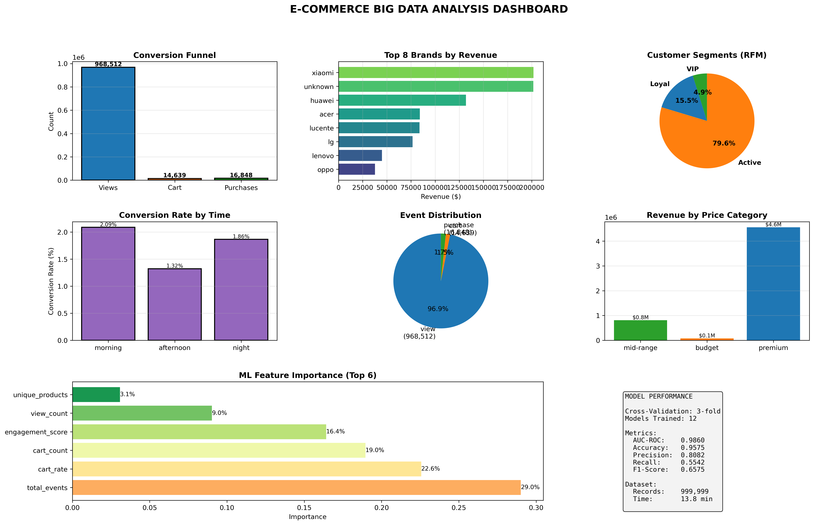

# E-Commerce Big Data Analysis with Spark & Hadoop



## 📌 Overview
This project analyzes **1 million e-commerce interaction records** using a distributed Big Data pipeline. It leverages **Apache Hadoop (HDFS)** for storage and **Apache Spark (PySpark)** for processing, culminating in a Random Forest Machine Learning model to predict purchase intent.

## 🚀 Key Results
* **Performance:** Processed 1M records in ~5.4 minutes.
* **ML Accuracy:** 95.75% (AUC-ROC: 0.986).
* **Key Insight:** Cart abandonment rate is negative (-15%), indicating heavy "Direct Buy" behavior where users bypass the cart.

## 🛠️ Tech Stack
* **Apache Spark 3.5.3** (PySpark RDDs & DataFrames)
* **Apache Hadoop 3.3.4** (HDFS)
* **Python** (Matplotlib, NumPy, Pandas)

## 📂 Files
* `final_ultra.py`: Main Spark application logic.
* `run_pipeline.sh`: Shell script to execute the job and generate the summary report.
* `ecommerce_analysis_dashboard.png`: Generated visual output.

## ⚙️ How to Run
1.  Ensure Hadoop and Spark are running.
2.  Place data in HDFS: `hdfs dfs -put ecommerce_sample.csv /ecommerce/`
3.  Run the pipeline:
    ```bash
    ./run_pipeline.sh
    ```
